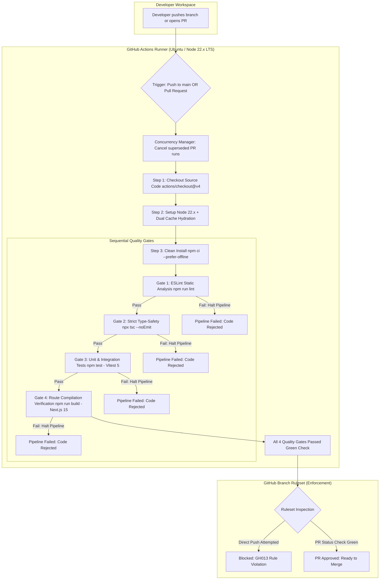

# 06 Handoff: 369 AKR UNIVERSE SOP — CI/CD Pipeline & Automated Quality Gates

> **ACTIVE CANONICAL SPECIFICATION (September 2026)**  
> This document records the completion of **Phase 6** (Continuous Integration Pipeline, Automated Quality Gates, Cross-Runtime Config Normalization, and GitHub Branch Ruleset Protection).  
> **Current Status**: Active, Production Verified & Enforced. All 4 automated quality gates running on Node 22.x LTS in GitHub Actions; direct pushes to `main` blocked by repository ruleset.  
> **Canonical Documentation**: Refer to [README.md](file:///g:/369/README.md), [ARCHITECTURE.md](file:///g:/369/docs/ARCHITECTURE.md), [SETUP_AND_DEPLOYMENT.md](file:///g:/369/docs/SETUP_AND_DEPLOYMENT.md), and [TESTING.md](file:///g:/369/docs/TESTING.md) for active production specifications.

**Date**: September 27, 2026  
**Engineer**: Lead DevOps Engineer & Principal Systems Architect  
**Domain**: CI/CD Pipelines, GitHub Actions, Automated Quality Gates, Static Analysis, Strict Type-Safety, Vitest Test Automation, Next.js 15 App Router Verification, Branch Protection Rulesets  
**Status**: ACTIVE PRODUCTION HANDOFF · Phase 6 Completed  

---

## 1. Executive Summary

In this engineering phase, we transitioned the **369 AKR UNIVERSE Subcontractor Operations Portal (SOP)** from manual local developer verification to an **Automated Cloud Quality Gate** pipeline.

Prior to this phase, ensuring type-safety, test pass rates, and build integrity depended on developer discipline before pushing code. This created severe operational risks:
1. Accidental broken builds, syntax errors, or unhandled null references could be pushed directly to `main`.
2. Missing or mismatched environment variables could cause silent failures in production deployments.
3. Regressions in statutory tax calculations (CGST/SGST/IGST, Section 194C TDS, 5% retention) could slip past reviews and corrupt milestone payouts.
4. Git history could be overwritten via `git push --force` or branch deletion.

We designed and implemented a production-grade CI/CD pipeline using **GitHub Actions** ([`.github/workflows/production-gate.yml`](file:///g:/369/.github/workflows/production-gate.yml)) and locked down the `main` branch with a modern **GitHub Branch Ruleset**.

```
Manual Local Checks ────────► Automated Cloud Quality Gate Pipeline
- Manual 'npm test' & 'tsc'     - Automated GitHub Actions on push & PR
- Direct pushes to main allowed - main protected by GitHub Branch Ruleset
- Risk of unverified merges     - 4 Sequential Quality Gates must pass green
- Potential build breaks in prod- All 26 App Router routes statically compiled in CI
```

---

## 2. Architecture & Components Delivered



### 2.1 Workflow Pipeline ([`.github/workflows/production-gate.yml`](file:///g:/369/.github/workflows/production-gate.yml))

The pipeline runs on `ubuntu-latest` inside a pinned **Node 22.x LTS** environment:

1. **Triggers & Concurrency Control**:
   - Executes on `push` to `main` and all `pull_request` lifecycle events (`opened`, `synchronize`, `reopened`, `ready_for_review`).
   - Uses `concurrency.cancel-in-progress: true` on pull requests to terminate redundant runs when subsequent commits are pushed.

2. **Dual-Layer Caching**:
   - `actions/setup-node@v4`: Automatically caches `~/.npm` via lockfile hash.
   - `actions/cache@v4`: Caches `.next/cache` using `hashFiles('**/package-lock.json')` and source globs (`**.[jt]s`, `**.[jt]sx`), cutting subsequent build times significantly.

3. **Grounded Mock Environment Variables**:
   - Supplies fallback variables (`NEXT_PUBLIC_SUPABASE_URL`, `NEXT_PUBLIC_SUPABASE_ANON_KEY`, `SUPABASE_SERVICE_ROLE_KEY`) so Next.js static page compilation and route trace generation succeed in CI without exposing live production keys.

---

### 2.2 The 4 Automated Quality Gates

Every code change must sequentially pass all four quality gates:

| Gate | Command | Verification Scope | Exit Condition |
| :--- | :--- | :--- | :--- |
| **Gate 1: Static Analysis** | `npm run lint` | ESLint across all 26 App Router routes, components, and utilities using `next/core-web-vitals`. | Exactly `0` errors. |
| **Gate 2: Type-Safety** | `npx tsc --noEmit` | Strict TypeScript compiler validation against [`tsconfig.json`](file:///g:/369/tsconfig.json). | Exactly `0` compilation errors. |
| **Gate 3: Automated Tests** | `npm test` | Vitest 5 suite executing **36 tests** across 4 test suites (Zod schemas, Admin Identity Vault, Tax Invoices, KYC Dossiers). | All `36/36` tests passing. |
| **Gate 4: Route Compilation** | `npm run build` | Next.js 15 production build validating static page generation across all **26 App Router routes**. | Clean compilation of all `26/26` routes. |

---

### 2.3 Configuration Normalization Delivered

1. **[`vitest.config.ts`](file:///g:/369/vitest.config.ts)**:
   - Replaced fragile `import.meta.dirname` with universal `path.resolve(process.cwd(), "./src")`.
   - Resolves runtime path resolution crashes under CommonJS bundling modes.

2. **[`.eslintrc.json`](file:///g:/369/.eslintrc.json)**:
   - Provisioned canonical ESLint configuration extending `"next/core-web-vitals"`.

3. **[`package.json`](file:///g:/369/package.json)**:
   - Updated `"lint"` script from `"next lint"` to `"eslint ."`.
   - Pinned `eslint` (`^8.57.1`) and `eslint-config-next` (`^15.1.4`).

---

### 2.4 GitHub Branch Ruleset: `Production Quality Gate`

A repository-level branch ruleset was configured in GitHub Settings:
- **Target**: `Include default branch` (`main`).
- **Enforcement Status**: `Active`.
- **Restrict Deletions**: Enabled (prevents accidental or malicious branch deletion).
- **Block Force Pushes**: Enabled (disallows `git push --force` history alterations).
- **Require Pull Request Before Merging**: Enabled (with stale approval dismissals on new commits).
- **Require Status Checks to Pass**: Enabled (`Production Quality Gate` required).
- **Require Branches Up-to-Date**: Enabled (guarantees PR code is validated against current `main`).

---

## 3. Root Cause Analysis (RCA) & Resolution of CI Failure

During the initial run (Run `#1`), the workflow failed at the Vitest step after 37 seconds. We diagnosed two compounding root causes:

1. **Node Engine Requirement**:
   - `vitest@5.0.1` specifies in `package.json`: `"engines": { "node": "^22.12.0 || ^24.0.0 || >=26.0.0" }`.
   - The runner was originally pinned to `node-version: 20.x`, triggering an engine incompatibility on runner startup.
   - **Fix**: Upgraded runner to `node-version: 22.x` (Active LTS).

2. **CommonJS / ESM Path Resolution**:
   - Because `package.json` does not set `"type": "module"`, Vite's config loader processes `vitest.config.ts` in CommonJS mode.
   - Under CJS, `import.meta` compiles to an empty object `{}`. Consequently, `import.meta.dirname` was `undefined`, causing `path.resolve(undefined, "./src")` to throw `TypeError: The "paths[0]" argument must be of type string. Received undefined`.
   - **Fix**: Replaced alias with `path.resolve(process.cwd(), "./src")`.

### Empirical Verification
Following commit `c8134c6`, GitHub Actions Run `#36253081108` executed with **100% green checkmarks across all steps** in 1m 32s.

---

## 4. Empirical Proof of Enforcement

To verify that the GitHub Branch Ruleset was actively protecting `main`, a direct push to `main` was attempted locally:
```bash
git push origin main
```

GitHub immediately rejected the push at the network boundary:
```text
remote: error: GH013: Repository rule violations found for refs/heads/main.
remote: - Changes must be made through a pull request.
remote: - Required status check "Production Quality Gate" is expected.
To https://github.com/varunlad453-TreY/369-AKR.git
 ! [remote rejected] main -> main (push declined due to repository rule violations)
```

This confirms that **direct pushes to `main` are impossible**. All code must be validated by the automated quality gate before it can be merged.

---

## 5. Daily Engineering Runbook

All future development follows the standard 3-step feature branch workflow:

1. **Create Branch**:
   ```bash
   git checkout -b feat/your-feature-name
   ```
2. **Commit & Push**:
   ```bash
   git add .
   git commit -m "feat: description of changes"
   git push -u origin feat/your-feature-name
   ```
3. **Open Pull Request on GitHub**:
   - GitHub Actions will automatically start **`Production Quality Gate`**.
   - Verify that all 4 gates (Lint, Types, Tests, Build) turn green.
   - Click **Squash and merge** to safely incorporate the feature into `main`.
