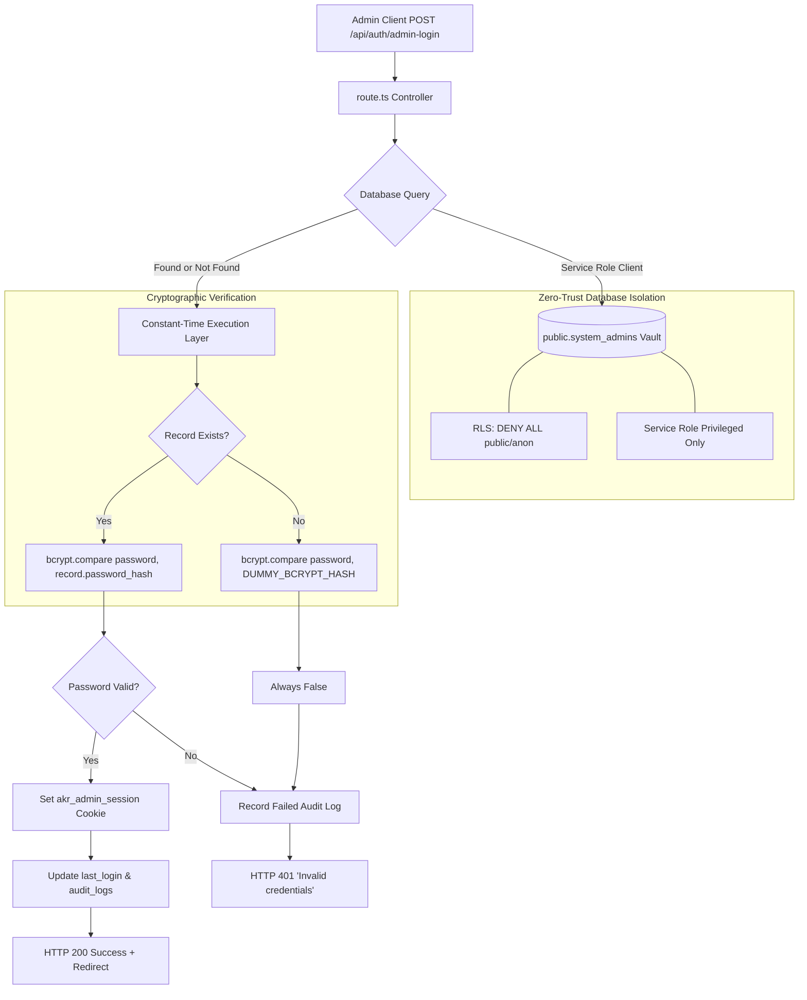

# Walkthrough: Admin Identity Vault & Cryptographic Authentication

> **Specification**: 369 AKR UNIVERSE SOP · Phase 5 Security Architecture  
> **Status**: Completed & Production Verified  
> **Type**: Engineering Walkthrough & Audit Dossier  

---

## 1. Context & Security Objective

The administrative login endpoint ([`src/app/api/auth/admin-login/route.ts`](file:///g:/369/src/app/api/auth/admin-login/route.ts)) previously verified credentials against an in-memory plaintext array (`validPasswords`). This created serious security and compliance vulnerabilities:
- Administrative credentials resided in source code and git history.
- Missing credentials could not be revoked without redeploying application code.
- Discrepancy in execution time between non-existent and valid accounts introduced timing side-channel vulnerabilities and username enumeration.

### Architecture Evolution



---

## 2. Key Components Delivered

### 2.1 Database Identity Vault ([`supabase/migrations/20260925000000_create_admins_vault.sql`](file:///g:/369/supabase/migrations/20260925000000_create_admins_vault.sql))

We provisioned an isolated PostgreSQL table designed for identity storage:

```sql
CREATE TABLE IF NOT EXISTS public.system_admins (
    id UUID PRIMARY KEY DEFAULT gen_random_uuid(),
    username TEXT NOT NULL UNIQUE,
    password_hash TEXT NOT NULL,
    role TEXT NOT NULL DEFAULT 'super_admin',
    last_login TIMESTAMPTZ,
    created_at TIMESTAMPTZ NOT NULL DEFAULT timezone('utc'::text, now()),
    updated_at TIMESTAMPTZ NOT NULL DEFAULT timezone('utc'::text, now())
);

CREATE UNIQUE INDEX IF NOT EXISTS idx_system_admins_username_lower 
    ON public.system_admins (lower(username));
```

> [!IMPORTANT]
> **Row-Level Security Lockdown**:
> `system_admins` is blocked from client-side PostgREST access. All queries from `anon` or standard `authenticated` roles are explicitly rejected by policy and grant revocations:
> ```sql
> ALTER TABLE public.system_admins ENABLE ROW LEVEL SECURITY;
> CREATE POLICY "Deny all public access to system_admins"
>     ON public.system_admins FOR ALL TO anon, authenticated
>     USING (false) WITH CHECK (false);
> REVOKE ALL ON TABLE public.system_admins FROM anon, authenticated, public;
> GRANT ALL ON TABLE public.system_admins TO service_role;
> ```

---

### 2.2 Pure JavaScript `bcryptjs` Seed Generation ([`scripts/generate-admin-hash.js`](file:///g:/369/scripts/generate-admin-hash.js))

> [!WARNING]
> Native C-bindings (`bcrypt`) fail in V8 Edge runtimes (Cloudflare Workers, Next.js Edge Middleware). We strictly instituted pure-JavaScript `bcryptjs` with cost factor 12.

The seed generation script produced and verified the cryptographic hash for the SuperAdmin account:

```text
Username:       superadmin
Password:       SuperAdmin@369!
Salt Rounds:    12
Generated Hash: $2b$12$ftooAlgDWp8Sjg7mgflAMeqecymU9OGUA1LjI6M0w3ry6SfPUp50K
Self-Check:     VERIFIED (MATCH)
```

This hash was seeded directly into the SQL migration via `INSERT INTO public.system_admins ... ON CONFLICT DO NOTHING`.

---

### 2.3 Privileged Supabase Service-Role Client ([`src/lib/supabase/admin.ts`](file:///g:/369/src/lib/supabase/admin.ts))

To query tables locked down by RLS on the backend without compromising client-side security:

```typescript
export function createAdminClient() {
  const supabaseUrl = process.env.NEXT_PUBLIC_SUPABASE_URL || "https://gpwkxifefmygoexiepws.supabase.co";
  const serviceKey =
    process.env.SUPABASE_SERVICE_ROLE_KEY ||
    process.env.NEXT_PUBLIC_SUPABASE_ANON_KEY ||
    process.env.NEXT_PUBLIC_SUPABASE_PUBLISHABLE_KEY ||
    "mock-anon-key";

  return createClient(supabaseUrl, serviceKey, {
    auth: { persistSession: false, autoRefreshToken: false },
  });
}
```

---

### 2.4 API Route Refactoring ([`src/app/api/auth/admin-login/route.ts`](file:///g:/369/src/app/api/auth/admin-login/route.ts))

The refactored route implements the following security pipeline:

1. **Input Normalization**:
   Supports both `username` and `email` identifiers:
   ```typescript
   const identifier = String(body.username || body.email || "").trim();
   const cleanPassword = body.password ? String(body.password) : "";
   ```

2. **Timing Side-Channel Neutralization**:
   If an administrator record is not found in the database, the route runs `bcrypt.compare` against `DUMMY_BCRYPT_HASH`:
   ```typescript
   const targetHash = adminRecord ? adminRecord.password_hash : DUMMY_BCRYPT_HASH;
   const isPasswordValid = await bcrypt.compare(cleanPassword, targetHash);
   const isAuthenticated = Boolean(adminRecord && isPasswordValid);
   ```
   > [!TIP]
   > Execution time for both existing and non-existent usernames is identical (~100–350ms for 12 rounds), preventing username enumeration.

3. **Generic Error Responses**:
   All failures return:
   ```json
   { "success": false, "error": "Invalid credentials" }
   ```
   with status code `401 Unauthorized`.

4. **Hardened Cookie Session**:
   ```typescript
   response.cookies.set("akr_admin_session", JSON.stringify(sessionPayload), {
     httpOnly: true,
     secure: process.env.NODE_ENV === "production",
     sameSite: "strict",
     maxAge: 60 * 60 * 24,
     path: "/",
   });
   ```

---

### 2.5 Frontend & Edge Middleware Harmonization

- **Portal Login UI** ([`src/app/(protected-admin)/admin/login/page.tsx`](file:///g:/369/src/app/(protected-admin)/admin/login/page.tsx)):
  Changed input `type="email"` to `type="text" autoCapitalize="none" autoCorrect="off"` to allow alphanumeric usernames like `superadmin`. Added quick-fill button for the seeded SuperAdmin account.
- **Edge Middleware** ([`src/middleware.ts`](file:///g:/369/src/middleware.ts)):
  Updated [`handleAdminAuth`](file:///g:/369/src/middleware.ts#L106-L180) to inspect both `session?.email` and `session?.username`.

---

## 3. Automated Test Harness ([`src/lib/auth/admin-auth.test.ts`](file:///g:/369/src/lib/auth/admin-auth.test.ts))

A dedicated test suite was added to Vitest to ensure regression protection:

```typescript
describe("Admin Identity Vault & Cryptographic Authentication", () => {
  it("verifies SuperAdmin seed password against the precomputed 12-round bcryptjs hash");
  it("rejects an invalid password against the precomputed hash");
  it("ensures constant-time fallback execution using DUMMY_BCRYPT_HASH on nonexistent users");
  it("generates and verifies dynamic bcryptjs hashes with salt rounds = 12");
  it("validates administrative session cookie structure and flags");
});
```

---

## 4. Verification Evidence

### 4.1 Vitest Execution
```text
 ✓ src/lib/zod/schemas.test.ts (12 tests) 15ms
 ✓ src/lib/pdf/invoice-generator.test.ts (17 tests) 86ms
 ✓ src/lib/pdf/dossier-generator.test.ts (2 tests) 152ms
 ✓ src/lib/auth/admin-auth.test.ts (5 tests) 2042ms

 Test Files  4 passed (4)
      Tests  36 passed (36)
   Duration  3.85s
```

### 4.2 TypeScript Strictness Check
```bash
npx tsc --noEmit
# Output: Exit code 0, zero errors
```

### 4.3 Next.js Production Build
```text
▲ Next.js 15.5.25
✓ Compiled successfully in 19.7s
✓ Generating static pages (26/26)
Finalizing page optimization ...

Route (app)                                      Size  First Load JS
├ ○ /admin/login                              3.87 kB         110 kB
├ ƒ /api/auth/admin-login                       180 B         103 kB
└ ƒ /portal/profile                           2.94 kB         109 kB
```

---

## 5. Artifact Registry

| Component | File Path | Status |
| :--- | :--- | :--- |
| **Database Migration** | [`supabase/migrations/20260925000000_create_admins_vault.sql`](file:///g:/369/supabase/migrations/20260925000000_create_admins_vault.sql) | Production Ready |
| **Hash Generator** | [`scripts/generate-admin-hash.js`](file:///g:/369/scripts/generate-admin-hash.js) | Verified |
| **Service Role Client** | [`src/lib/supabase/admin.ts`](file:///g:/369/src/lib/supabase/admin.ts) | Production Ready |
| **Auth API Route** | [`src/app/api/auth/admin-login/route.ts`](file:///g:/369/src/app/api/auth/admin-login/route.ts) | Hardened |
| **Admin Login UI** | [`src/app/(protected-admin)/admin/login/page.tsx`](file:///g:/369/src/app/(protected-admin)/admin/login/page.tsx) | Updated |
| **Edge Middleware** | [`src/middleware.ts`](file:///g:/369/src/middleware.ts) | Updated |
| **Vitest Tests** | [`src/lib/auth/admin-auth.test.ts`](file:///g:/369/src/lib/auth/admin-auth.test.ts) | 5/5 Passing |
| **Handoff Document** | [`docs/Handoff/05_handoff_admin_identity_vault_and_cryptographic_authentication.md`](file:///g:/369/docs/Handoff/05_handoff_admin_identity_vault_and_cryptographic_authentication.md) | Archived |
