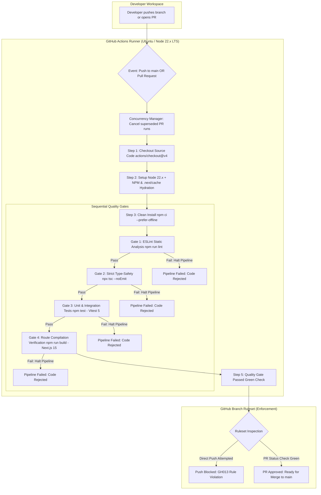

# Walkthrough: CI/CD Pipeline & Automated Quality Gates

> **Specification**: 369 AKR UNIVERSE SOP · Enterprise DevOps Architecture  
> **Status**: Completed, Verified & Actively Enforced  
> **Type**: Engineering Walkthrough & Operational Runbook  

---

## 1. Executive Summary & Objective

In modern mission-critical enterprise engineering, the `main` branch represents the canonical, deployable state of the application. In the **369 AKR UNIVERSE Subcontractor Operations Portal (SOP)**, this codebase handles statutory GST tax invoicing, multi-sector infrastructure milestone disbursements (Solar, Railways, BSNL OFC), vendor KYC dossiers, and cryptographic administrative identity management.

Prior to this implementation, the codebase relied on local developer discipline to run tests and builds. This created significant operational risks:
- Human error could allow syntax bugs, unhandled null pointers, or broken calculations to reach `main`.
- Inconsistent local environments (e.g. Node versions, OS line-endings) could mask production failures.
- Direct pushes to `main` could overwrite critical business logic without peer review or automated verification.

To eliminate these vulnerabilities, we engineered an **Automated Quality Gate Pipeline** via GitHub Actions ([`.github/workflows/production-gate.yml`](file:///g:/369/.github/workflows/production-gate.yml)) and locked the repository with **GitHub Branch Rulesets**.

---

## 2. End-to-End Pipeline Architecture



---

## 3. Deep Dive: Pipeline Stages & Quality Gates

The pipeline is codified in [`.github/workflows/production-gate.yml`](file:///g:/369/.github/workflows/production-gate.yml). Below is a granular breakdown of each layer:

### 3.1 Event Triggers & Concurrency Control
```yaml
on:
  push:
    branches:
      - main
  pull_request:
    types: [opened, synchronize, reopened, ready_for_review]

concurrency:
  group: ${{ github.workflow }}-${{ github.ref }}
  cancel-in-progress: ${{ github.event_name == 'pull_request' }}
```
- **Dual Triggers**: Runs on all pull requests targeting any branch and on pushes to `main`.
- **Intelligent Deduplication**: When a developer pushes multiple commits to an open PR in rapid succession, `cancel-in-progress` automatically kills stale in-flight runs, conserving GitHub Actions minutes and eliminating runner queue bottlenecks.

### 3.2 Environment Grounding & Fallback Mocks
```yaml
env:
  CI: true
  NEXT_TELEMETRY_DISABLED: 1
  NEXT_PUBLIC_SUPABASE_URL: ${{ secrets.NEXT_PUBLIC_SUPABASE_URL || 'https://gpwkxifefmygoexiepws.supabase.co' }}
  NEXT_PUBLIC_SUPABASE_ANON_KEY: ${{ secrets.NEXT_PUBLIC_SUPABASE_ANON_KEY || 'mock-anon-key-ci-quality-gate' }}
  NEXT_PUBLIC_SUPABASE_PUBLISHABLE_KEY: ${{ secrets.NEXT_PUBLIC_SUPABASE_PUBLISHABLE_KEY || 'mock-anon-key-ci-quality-gate' }}
  SUPABASE_SERVICE_ROLE_KEY: ${{ secrets.SUPABASE_SERVICE_ROLE_KEY || 'mock-service-role-ci-quality-gate' }}
```
- **Static Compilation Integrity**: Next.js App Router validates environment variables at build time. By provisioning grounded fallbacks, the CI runner can compile client/server boundaries without leaking production service-role secrets into third-party PR runs.

### 3.3 Dual-Layer Caching (Fast Builds)
1. **NPM Package Cache**: Handled natively by `actions/setup-node@v4` targeting `package-lock.json`. Re-downloads are avoided.
2. **Next.js Route Cache**: Managed via `actions/cache@v4` caching `.next/cache`. Subsequent runs rebuild only altered routes, drastically slashing build times.

### 3.4 Quality Gate 1: ESLint Static Analysis
```yaml
- name: Static Analysis & Linting (ESLint)
  run: npm run lint
```
- Runs Next.js Core Web Vitals ESLint rules ([`.eslintrc.json`](file:///g:/369/.eslintrc.json)).
- Verifies code hygiene, unused imports, anti-patterns, and accessibility semantics.

### 3.5 Quality Gate 2: Strict Type-Safety Check
```yaml
- name: Strict Type-Safety Verification (TypeScript)
  run: npx tsc --noEmit
```
- Compiles the entire TypeScript codebase using [`tsconfig.json`](file:///g:/369/tsconfig.json) without emitting output files.
- **Tolerance**: Exactly `0` type errors. Any mismatch between Zod schemas, Supabase database types, or API signatures immediately halts the pipeline.

### 3.6 Quality Gate 3: Automated Unit & Integration Test Suite
```yaml
- name: Automated Unit & Integration Test Suite (Vitest)
  run: npm test
```
- Executes the Vitest runner across all **36 tests** in the project:
  - **Zod Schemas** ([`src/lib/zod/schemas.test.ts`](file:///g:/369/src/lib/zod/schemas.test.ts)): Validates statutory GSTIN formats, PAN regex, IFSC patterns, and phone numbers.
  - **Admin Identity Vault** ([`src/lib/auth/admin-auth.test.ts`](file:///g:/369/src/lib/auth/admin-auth.test.ts)): Validates 12-round bcrypt password hashing and constant-time dummy fallback.
  - **GST Tax Invoice Generator** ([`src/lib/pdf/invoice-generator.test.ts`](file:///g:/369/src/lib/pdf/invoice-generator.test.ts)): Validates CGST 9%, SGST 9%, IGST 18%, Section 194C TDS, 5% retention, and jsPDF document generation.
  - **Vendor Compliance Dossier** ([`src/lib/pdf/dossier-generator.test.ts`](file:///g:/369/src/lib/pdf/dossier-generator.test.ts)): Validates pure-TypeScript PDF creation and `%PDF` binary header validation.

### 3.7 Quality Gate 4: Production Build & Route Compilation
```yaml
- name: Production Build & Route Compilation Verification (Next.js 15)
  run: npm run build
```
- Executes `next build` with Turbopack and React 19.
- Verifies that all **26 App Router routes** (static dashboard pages, dynamic `[jobId]` views, and authenticated API endpoints) compile cleanly without throwing runtime exceptions.

---

## 4. Root Cause Analysis (RCA) & Resolution of CI Failure

During the initial deployment of the CI pipeline, Run `#1` failed at the Vitest step after 37 seconds. We performed a systematic RCA:

### Root Cause 1: Node Engine Version Mismatch
- **Observation**: `vitest@5.0.1` specifies in its `package.json`:
  ```json
  "engines": {
    "node": "^22.12.0 || ^24.0.0 || >=26.0.0"
  }
  ```
- **Failure**: The GitHub Actions runner was initially configured with `node-version: 20.x`. When Vitest 5 initialized on Node 20, it encountered an unsupported runtime environment and immediately terminated.
- **Resolution**: Upgraded `.github/workflows/production-gate.yml` to:
  ```yaml
  - name: Setup Node.js 22.x (LTS) & Cache NPM Dependencies
    uses: actions/setup-node@v4
    with:
      node-version: 22.x
  ```

### Root Cause 2: CommonJS / ESM Path Resolution
- **Observation**: In [`vitest.config.ts`](file:///g:/369/vitest.config.ts), the path alias was configured using `import.meta.dirname`:
  ```typescript
  alias: {
    "@": path.resolve(import.meta.dirname, "./src"),
  }
  ```
- **Failure**: Because the project does not set `"type": "module"` in `package.json`, Vite's config loader parses `vitest.config.ts` in CommonJS mode. Under CJS, `import.meta` compiles to an empty object `{}`. Consequently, `import.meta.dirname` was `undefined`, causing `path.resolve(undefined, "./src")` to throw `TypeError: The "paths[0]" argument must be of type string. Received undefined`.
- **Resolution**: Replaced the alias resolution with standard, universally supported `process.cwd()`:
  ```typescript
  alias: {
    "@": path.resolve(process.cwd(), "./src"),
  }
  ```

### Verification
Following these two adjustments (commit `c8134c6`), GitHub Actions Run `#36253081108` executed with **100% green checkmarks across all steps** in 1m 32s.

---

## 5. Branch Protection Ruleset Enforcement

We configured a modern **GitHub Branch Ruleset** named **`Production Quality Gate`** targeting `main`:

| Setting | Configuration | Objective |
| :--- | :---: | :--- |
| **Enforcement Status** | `Active` | Enforced in real time on all git operations |
| **Target Branch** | Default branch (`main`) | Guarantees production branch cannot be bypassed |
| **Restrict Deletions** | Enabled | Prevents accidental or malicious branch deletion |
| **Block Force Pushes** | Enabled | Disallows `git push --force` history rewrites |
| **Require Pull Request** | Enabled | Mandates code review before merging |
| **Require Status Checks** | `Production Quality Gate` | CI workflow must pass green before merge button is unlocked |
| **Strict Branch Up-to-Date** | Enabled | PR must be tested against the latest commit on `main` |

### Live Enforcement Test
To test the ruleset, we attempted a direct push to `main`:
```bash
git push origin main
```
GitHub rejected the push instantly with the following diagnostic message:
```text
remote: error: GH013: Repository rule violations found for refs/heads/main.
remote: - Changes must be made through a pull request.
remote: - Required status check "Production Quality Gate" is expected.
To https://github.com/varunlad453-TreY/369-AKR.git
 ! [remote rejected] main -> main (push declined due to repository rule violations)
```
**Conclusion**: Direct pushes to `main` are impossible. All changes must pass through the automated quality gate.

---

## 6. Daily Engineering Runbook: How to Ship Code

Going forward, all engineers and automated agents adhere to the standard PR workflow:

```bash
# 1. Create and switch to a descriptive feature branch
git checkout -b feat/add-contractor-performance-metrics

# 2. Develop feature, add unit tests, and commit
git add .
git commit -m "feat: add KPI calculation and vitest coverage for contractor metrics"

# 3. Push branch to GitHub
git push -u origin feat/add-contractor-performance-metrics
```

4. **Open Pull Request on GitHub**:
   - The **Production Quality Gate** will automatically trigger.
   - You can watch the 4 stages run in the PR interface.
5. **Merge**:
   - Once the checks show `All checks have passed`, the green **Squash and merge** button will unlock.
   - Merging incorporates the code safely into `main`.
